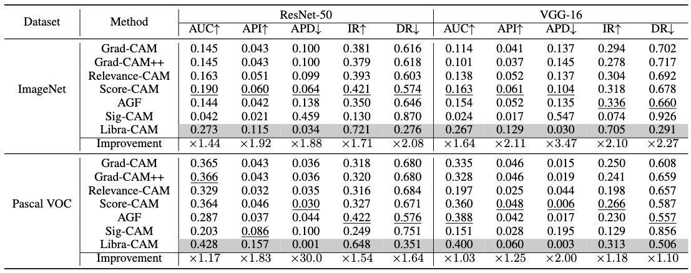
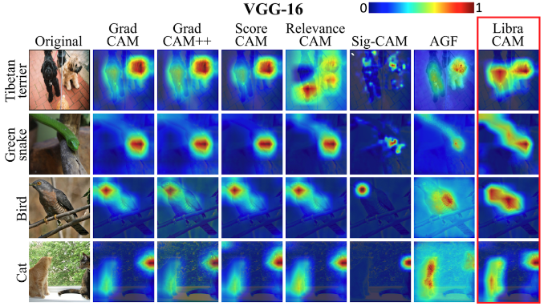
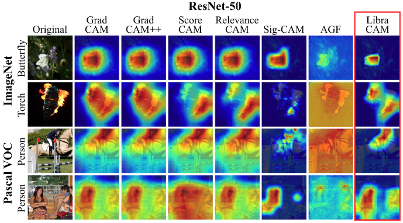

# Libra-CAM: An Activation-Based Attribution Based on the Linear Approximation of Deep Neural Nets and Threshold Calibration, IJCAI'22
**Sangkyun Lee (Corresponding author), Sungmin Han**

AIRLAB, School of Cybersecurity, Korea University


### 📄 Abstract

Universal application of AI has increased the need to explain why an AI model makes a specific decision in a human-understandable form.
Among many related works, the class activation map (CAM)-based methods have been successful recently, creating input attribution based on the weighted sum of activation maps in convolutional neural networks. 
However, existing methods use channel-wise importance weights with specific architectural assumptions, relying on arbitrarily chosen attribution threshold values in their quality assessment: we think these can degrade the quality of attribution. 
In this paper, we propose Libra-CAM, a new CAM-style attribution method based on the best linear approximation of the layer (as a function) between the penultimate activation and the target-class score output. 
From the approximation, we derive the base formula of Libra-CAM, which is applied with multiple reference activations from a pre-built library. 
We construct Libra-CAM by averaging these base attribution maps, taking a threshold calibration procedure to optimize its attribution quality. 
Our experiments show that Libra-CAM can be computed in a reasonable time and is superior to the existing attribution methods in quantitative and qualitative attribution quality evaluations.

Keywords: Explainable/Interpretable Machine Learning, CAM-style Attribution Map, Threshold Calibration, Linear Approximation

You can read the full paper at  
👉 [Official Paper on OpenReview (IJCAI 2022)](https://www.ijcai.org/proceedings/2022/442)

---

## 📈 Main Results

We evaluated attribution quality across five metrics (AUC, API, APD, IR, DR) on ImageNet and Pascal VOC using ResNet-50 and VGG-16 models.
Libra-CAM consistently achieved the best performance across most metrics and models.

| Dataset     | Model | AUC ↑ | API ↑ | APD ↓ | IR ↑ | DR ↓ |
|-------------|----------|-------|-------|--------|------|------|
| ImageNet    | ResNet-50| **0.273** | **0.115** | **0.034** | **0.721** | **0.276** |
| ImageNet    | VGG-16   | **0.267** | **0.129** | **0.030** | **0.705** | **0.291** |
| Pascal VOC  | ResNet-50| **0.428** | **0.157** | **0.001** | **0.648** | **0.351** |
| Pascal VOC  | VGG-16   | **0.400** | **0.060** | **0.003** | **0.313** | **0.506** |

> **↑ Higher is better**, **↓ Lower is better**

Libra-CAM improves attribution quality by up to ×2.27 across multiple evaluation metrics, outperforming all competing methods.

Full table is available below.

<p align="center">
  
  <br/>
  <em>Figure: Full attribution map evaluation across methods, backbones, and datasets.</em>
</p>

### 🧠 Qualitative Examples

Below are example attribution maps generated by Libra-CAM and competing methods.

<p align="center">
  
  <br/>
  <em>Figure: Attribution results on VGG-16. Libra-CAM produces more focused and interpretable attributions.</em>
</p>

<p align="center">
  
  <br/>
  <em>Figure: Attribution results on ResNet-50. Libra-CAM better aligns with class-discriminative regions.</em>
</p>

## 📬 Contact

For questions, feedback, or collaboration opportunities — such as building customized reference libraries or adapting Libra-CAM to your use case — please refer to the contact information provided in the paper.


## Citation

If you found this work or code useful, please cite us:

```
@inproceedings{lee2022libra,
  title={Libra-CAM: An Activation-Based Attribution Based on the Linear Approximation of Deep Neural Nets and Threshold Calibration.},
  author={Lee, Sangkyun and Han, Sungmin},
  booktitle={IJCAI},
  pages={3185--3191},
  year={2022}
}
```
